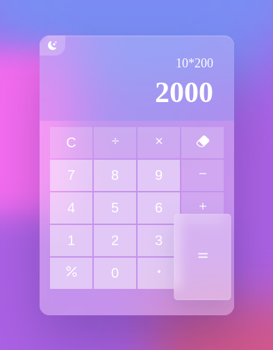
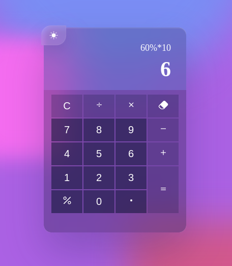

# Glassmorphism Calculator

## Spis Treści

- [Opis Projektu](#opis-projektu)
- [Funkcjonalności](#funkcjonalności)
- [Technologie](#technologie)
- [Instalacja](#instalacja)
- [Użycie](#użycie)
- [Testowanie](#testowanie)
- [Struktura Projektu](#struktura-projektu)
- [Screenshoty](#screenshoty)
- [Autor](#autor)

## Opis Projektu

Glassmorphism Calculator to nowoczesna aplikacja webowa, która umożliwia wykonywanie podstawowych działań arytmetycznych takich jak dodawanie, odejmowanie, mnożenie i dzielenie. Aplikacja została zaprojektowana z wykorzystaniem stylu glassmorphism, co nadaje jej estetyczny i przejrzysty wygląd. Dodatkowo, kalkulator wspiera przełączanie między motywami jasnym a ciemnym.

## Funkcjonalności

- **Podstawowe działania arytmetyczne:** Dodawanie, odejmowanie, mnożenie, dzielenie.
- **Obsługa procentów:** Możliwość obliczania procentów.
- **Przycisk backspace:** Usuwanie ostatniego znaku z wyrażenia.
- **Przycisk clear:** Resetowanie bieżącego wyrażenia.
- **Obsługa liczb zmiennoprzecinkowych:** Wprowadzanie i obliczanie liczb z kropką dziesiętną.
- **Przełączanie motywów:** Możliwość przełączania między motywem jasnym a ciemnym.
- **Wsparcie dla klawiatury:** Możliwość wprowadzania danych za pomocą klawiatury.
- **Responsywny design:** Dostosowanie interfejsu do różnych rozmiarów ekranów.

## Technologie

- **HTML5:** Struktura aplikacji webowej.
- **CSS3:** Stylizacja i implementacja stylu glassmorphism.
- **JavaScript:** Logika działania kalkulatora.
- **Node.js:** Serwer statyczny do uruchomienia aplikacji lokalnie.
- **Cypress:** Automatyczne testy funkcjonalności kalkulatora.

## Instalacja

1. **Klonowanie Repozytorium:**

   ```bash
   git clone https://github.com/TwojeRepozytorium/glassmorphism-calculator.git
   cd glassmorphism-calculator
   ```

2. **Instalacja Zależności:**

   Upewnij się, że masz zainstalowany Node.js. Następnie zainstaluj zależności:

   ```bash
   npm install
   ```

3. **Uruchomienie Serwera:**

   Uruchom serwer statyczny za pomocą Node.js:

   ```bash
   node server.js 9000
   ```

   Aplikacja będzie dostępna pod adresem `http://localhost:9000`.

4. **Uruchomienie Testów Cypress:**

   Aby uruchomić testy automatyczne, wykonaj:

   ```bash
   npx cypress open
   ```

   Następnie wybierz odpowiedni test z interfejsu Cypress.

## Użycie

1. **Otwarcie Aplikacji:**

   Otwórz przeglądarkę i przejdź pod adres `http://localhost:9000`.

2. **Interfejs:**

   - **Przyciski liczbowe:** Kliknij na numery, aby wprowadzić liczby.
   - **Przyciski operacji:** Dodaj, odejmij, pomnóż lub podziel liczby.
   - **Przycisk równości:** Oblicz wynik wyrażenia.
   - **Przycisk procent:** Oblicz procent wartości.
   - **Przycisk backspace:** Usuń ostatni wprowadzony znak.
   - **Przycisk clear:** Resetuj bieżące wyrażenie.
   - **Przełączanie motywów:** Kliknij ikonę w lewym górnym rogu, aby zmienić motyw.

3. **Przykłady:**

   - **Dodawanie:** `7 + 3 = 10`
   - **Mnożenie:** `10 * 200 = 2000`

## Testowanie

Projekt zawiera zestaw testów automatycznych napisanych w Cypress, które sprawdzają poprawność działania kalkulatora.

### Uruchamianie Testów

1. **Uruchomienie serwera:**

   Upewnij się, że serwer jest uruchomiony na porcie 9000:

   ```bash
   node server.js 9000
   ```

2. **Uruchomienie Cypress:**

   W nowym terminalu uruchom Cypress:

   ```bash
   npx cypress open
   ```

   W oknie Cypress wybierz test `calculator.cy.js` z folderu `cypress/e2e`.

### Zakres Testów

- **Przełączanie motywów:** Sprawdzenie poprawności zmiany między motywem jasnym a ciemnym.
- **Wprowadzanie liczb:** Testowanie wprowadzania pojedynczych i wielocyfrowych liczb.
- **Podstawowe operacje:** Dodawanie, odejmowanie, mnożenie, dzielenie.
- **Obsługa procentów:** Obliczanie wartości procentowych.
- **Obsługa błędów:** Dzielenie przez zero, niekompletne wyrażenia.
- **Wsparcie dla klawiatury:** Wprowadzanie danych za pomocą klawiatury.
- **Edge Cases:** Obsługa dużych liczb, wielokrotne operatory, wyniki ujemne.

## Struktura Projektu

```
.
├── cypress
│   ├── e2e
│   │   └── calculator.cy.js
│   ├── fixtures
│   │   └── example.json
│   └── support
│       ├── commands.js
│       └── e2e.js
├── cypress.config.js
├── index.html
├── package.json
├── package-lock.json
├── script.js
├── server.js
└── style.css

5 katalogów, 11 plików
```

- **index.html:** Struktura HTML aplikacji kalkulatora.
- **style.css:** Stylizacja aplikacji, implementacja glassmorphism.
- **script.js:** Logika działania kalkulatora, obsługa zdarzeń.
- **server.js:** Prosty serwer statyczny uruchamiany za pomocą Node.js.
- **cypress/**: Folder zawierający testy automatyczne Cypress.
  - **e2e/calculator.cy.js:** Testy funkcjonalności kalkulatora.
  - **fixtures/**: Pliki danych testowych.
  - **support/**: Konfiguracje i polecenia wspierające testy.
- **cypress.config.js:** Konfiguracja Cypress.
- **package.json:** Zależności i skrypty projektu.
- **package-lock.json:** Zablokowane wersje zależności.

## Screenshoty




## Autor

**Jan Kowalski**

- **Email:** gax35208@student.gdynia.merito.pl
- **GitHub:** [github.com/Filip-Szettel/Calculator-Cypress-Tests](https://github.com/Filip-Szettel/Calculator-Cypress-Tests)

---