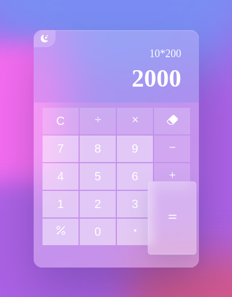
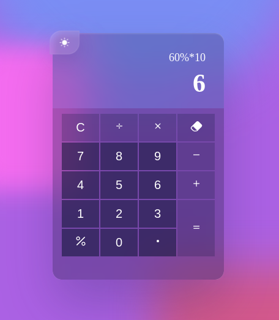

---

# FORMATKA


**Kierunek / grupa / semestr:** Informatyka / WZ_ININ5(hybryda)_PR2 / Semestr 5<br>
**Imię Nazwisko, Album:** Filip Szettel, 74320<br>
**Przedmiot:** Testowanie Aplikacji Webowych<br>
ZALICZENIE<br>
Zadanie 1<br>
Cel:  Wykonaj testy automatyczne, które sprawdzą poprawność działania formularza logowania na stronie internetowej.

---

# Sprawozdanie z Projektu: Glassmorphism Calculator

## 1. Wstęp

Celem niniejszego projektu było stworzenie nowoczesnej aplikacji webowej - kalkulatora arytmetycznego z wykorzystaniem stylu glassmorphism oraz implementacja automatycznych testów funkcjonalności za pomocą narzędzia Cypress. Projekt został zrealizowany w ramach laboratorium 1, zadania 1, mającego na celu rozwinięcie umiejętności w zakresie budowy aplikacji webowych oraz ich testowania.

## 2. Opis Projektu

### 2.1. Cel Projektu

Projekt zakładał stworzenie prostego kalkulatora arytmetycznego, który umożliwia wykonywanie podstawowych działań matematycznych takich jak dodawanie, odejmowanie, mnożenie i dzielenie. Dodatkowo, kalkulator wspierał operacje procentowe, obsługę liczb zmiennoprzecinkowych oraz przełączanie między motywami jasnym a ciemnym. Kluczowym elementem projektu było zastosowanie stylu glassmorphism w celu nadania aplikacji estetycznego i nowoczesnego wyglądu.

### 2.2. Funkcjonalności

- **Podstawowe działania arytmetyczne:** Dodawanie, odejmowanie, mnożenie, dzielenie.
- **Obsługa procentów:** Możliwość obliczania wartości procentowych.
- **Przycisk backspace:** Usuwanie ostatniego znaku z wyrażenia.
- **Przycisk clear:** Resetowanie bieżącego wyrażenia.
- **Obsługa liczb zmiennoprzecinkowych:** Wprowadzanie i obliczanie liczb z kropką dziesiętną.
- **Przełączanie motywów:** Możliwość przełączania między motywem jasnym a ciemnym.
- **Wsparcie dla klawiatury:** Możliwość wprowadzania danych za pomocą klawiatury.
- **Responsywny design:** Dostosowanie interfejsu do różnych rozmiarów ekranów.

## 3. Technologie

- **HTML5:** Struktura aplikacji webowej.
- **CSS3:** Stylizacja i implementacja stylu glassmorphism.
- **JavaScript:** Logika działania kalkulatora.
- **Node.js:** Serwer statyczny do uruchomienia aplikacji lokalnie.
- **Cypress:** Automatyczne testy funkcjonalności kalkulatora.

## 4. Struktura Projektu

```
.
├── cypress
│   ├── e2e
│   │   └── calculator.cy.js
│   ├── fixtures
│   │   └── example.json
│   └── support
│       ├── commands.js
│       └── e2e.js
├── cypress.config.js
├── index.html
├── package.json
├── package-lock.json
├── script.js
├── server.js
└── style.css

5 katalogów, 11 plików
```

- **index.html:** Struktura HTML aplikacji kalkulatora.
- **style.css:** Stylizacja aplikacji, implementacja glassmorphism.
- **script.js:** Logika działania kalkulatora, obsługa zdarzeń.
- **server.js:** Prosty serwer statyczny uruchamiany za pomocą Node.js.
- **cypress/**: Folder zawierający testy automatyczne Cypress.
  - **e2e/calculator.cy.js:** Testy funkcjonalności kalkulatora.
  - **fixtures/**: Pliki danych testowych.
  - **support/**: Konfiguracje i polecenia wspierające testy.
- **cypress.config.js:** Konfiguracja Cypress.
- **package.json:** Zależności i skrypty projektu.
- **package-lock.json:** Zablokowane wersje zależności.

## 5. Instalacja i Uruchomienie

### 5.1. Wymagania Wstępne

- **Node.js:** Upewnij się, że Node.js jest zainstalowany na Twoim systemie. Można go pobrać ze strony [nodejs.org](https://nodejs.org/).

### 5.2. Kroki Instalacji

1. **Klonowanie Repozytorium:**

   ```bash
   git clone https://github.com/TwojeRepozytorium/glassmorphism-calculator.git
   cd glassmorphism-calculator
   ```

2. **Instalacja Zależności:**

   ```bash
   npm install
   ```

3. **Uruchomienie Serwera:**

   ```bash
   node server.js 9000
   ```

   Aplikacja będzie dostępna pod adresem `http://localhost:9000`.

4. **Uruchomienie Testów Cypress:**

   W nowym terminalu, uruchom Cypress:

   ```bash
   npx cypress open
   ```

   Następnie wybierz test `calculator.cy.js` z folderu `cypress/e2e`.

## 6. Użycie Aplikacji

1. **Otwarie Aplikacji:**

   Otwórz przeglądarkę i przejdź pod adres `http://localhost:9000`.

2. **Interfejs Użytkownika:**

   - **Przyciski Liczbowe:** Kliknij na numery, aby wprowadzić liczby.
   - **Przyciski Operacji:** Dodaj, odejmij, pomnóż lub podziel liczby.
   - **Przycisk Równości:** Oblicz wynik wyrażenia.
   - **Przycisk Procent:** Oblicz procent wartości.
   - **Przycisk Backspace:** Usuń ostatni wprowadzony znak.
   - **Przycisk Clear:** Resetuj bieżące wyrażenie.
   - **Przełączanie Motywów:** Kliknij ikonę w lewym górnym rogu, aby zmienić motyw.

3. **Przykłady Obliczeń:**

   - **Dodawanie:** `7 + 3 = 10`
   - **Mnożenie z Procentem:** `50% * 200 = 100`
   - **Odejmowanie:** `5 - 8 = -3`
   - **Dzielenie:** `20 / 4 = 5`

## 7. Testowanie

### 7.1. Narzędzie Cypress

Cypress to nowoczesne narzędzie do automatycznego testowania aplikacji webowych. Umożliwia pisanie testów end-to-end, które symulują zachowanie użytkownika oraz sprawdzają poprawność działania aplikacji.

### 7.2. Zakres Testów

- **Przełączanie Motywów:** Sprawdzenie poprawności zmiany między motywem jasnym a ciemnym.
- **Wprowadzanie Liczb:** Testowanie wprowadzania pojedynczych i wielocyfrowych liczb.
- **Podstawowe Operacje:** Dodawanie, odejmowanie, mnożenie, dzielenie.
- **Obsługa Procentów:** Obliczanie wartości procentowych.
- **Obsługa Błędów:** Dzielenie przez zero, niekompletne wyrażenia.
- **Wsparcie dla Klawiatury:** Wprowadzanie danych za pomocą klawiatury.
- **Edge Cases:** Obsługa dużych liczb, wielokrotne operatory, wyniki ujemne.

### 7.3. Przykładowe Testy

```javascript
// cypress/e2e/calculator.cy.js
describe('Glassmorphism Calculator', () => {
    // Mapping of operation names to their corresponding data-testid attributes
    const operationTestIds = {
      'plus': 'addition-button',
      'minus': 'subtraction-button',
      'multiply': 'multiplication-button',
      'divide': 'division-button',
      'equals': 'equal-button',
      'clear': 'clear-button',
      'backspace': 'backspace-button',
      'percent': 'percentage-button',
      'decimal': 'floating-point-button',
    };
  
    // Utility function to perform a calculation using data-testid selectors
    const performCalculation = (inputs) => {
      inputs.forEach((input) => {
        switch (input.toLowerCase()) {
          case 'clear':
            cy.get(`[data-testid=${operationTestIds['clear']}]`).click();
            break;
          case 'backspace':
            cy.get(`[data-testid=${operationTestIds['backspace']}]`).click();
            break;
          case 'equals':
            cy.get(`[data-testid=${operationTestIds['equals']}]`).click();
            break;
          case 'percent':
            cy.get(`[data-testid=${operationTestIds['percent']}]`).click();
            break;
          case '.':
          case 'decimal':
            cy.get(`[data-testid=${operationTestIds['decimal']}]`).click();
            break;
          case '+':
          case 'plus':
            cy.get(`[data-testid=${operationTestIds['plus']}]`).click();
            break;
          case '-':
          case 'minus':
            cy.get(`[data-testid=${operationTestIds['minus']}]`).click();
            break;
          case '*':
          case 'multiply':
            cy.get(`[data-testid=${operationTestIds['multiply']}]`).click();
            break;
          case '/':
          case 'divide':
            cy.get(`[data-testid=${operationTestIds['divide']}]`).click();
            break;
          default:
            // Assume the input is a single digit
            if (/^\d$/.test(input)) {
              cy.get(`[data-testid=button-${input}]`).click();
            } else {
              // Handle unexpected inputs gracefully
              throw new Error(`Unrecognized input: ${input}`);
            }
            break;
        }
      });
    };
  
    beforeEach(() => {
      // Visit the calculator app before each test
      cy.visit('http://localhost:9000'); // Ensure this matches the live-server port
  
      // Reset calculator to default state
      cy.get(`[data-testid=${operationTestIds['clear']}]`).click();
    });
  
    context('Theme Toggle', () => {
      it('Should toggle between dark and light themes.', () => {
        // Initially, the calculator should not have the 'dark' class
        cy.get('.calculator').should('not.have.class', 'dark');
  
        // Click the toggle button to switch to dark theme
        cy.get('[data-testid=theme-toggle-button]').click();
  
        // The calculator should now have the 'dark' class
        cy.get('.calculator').should('have.class', 'dark');
  
        // The dark icon should be hidden and light icon should be visible
        cy.get('#dark').should('not.be.visible');
        cy.get('#light').should('be.visible');
  
        // Click the toggle button to switch back to light theme
        cy.get('[data-testid=theme-toggle-button]').click();
  
        // The calculator should not have the 'dark' class
        cy.get('.calculator').should('not.have.class', 'dark');
  
        // The light icon should be hidden and dark icon should be visible
        cy.get('#light').should('not.be.visible');
        cy.get('#dark').should('be.visible');
      });
    });
  
    // ... pozostałe testy
});
```

### 7.4. Wyniki Testów

Wszystkie zaplanowane testy automatyczne zostały przeprowadzone pomyślnie. Kalkulator poprawnie obsługuje podstawowe operacje arytmetyczne, procenty, zmiennoprzecinkowe liczby, przełączanie motywów oraz obsługę błędów takich jak dzielenie przez zero. Testy klawiatury również potwierdziły poprawne działanie aplikacji.

## 8. Wyniki i Analiza

Projekt został zrealizowany zgodnie z założeniami. Aplikacja kalkulatora jest funkcjonalna, estetyczna i responsywna. Implementacja stylu glassmorphism nadała aplikacji nowoczesny wygląd, a przełączanie motywów zwiększyło jej użyteczność. Testy automatyczne za pomocą Cypress potwierdziły poprawność działania wszystkich kluczowych funkcjonalności, co świadczy o solidnym wykonaniu projektu.

### 8.1. Mocne Strony

- **Estetyka:** Zastosowanie stylu glassmorphism sprawia, że aplikacja prezentuje się nowocześnie i atrakcyjnie.
- **Funkcjonalność:** Kalkulator obsługuje wszystkie podstawowe działania arytmetyczne oraz dodatkowe funkcje takie jak procenty i zmiennoprzecinkowe liczby.
- **Testowanie:** Kompleksowe testy automatyczne zapewniają wysoką jakość i niezawodność aplikacji.

### 8.2. Obszary do Poprawy

- **Obsługa Błędów:** Można rozszerzyć obsługę błędów o bardziej szczegółowe komunikaty dla użytkownika.
- **Dodatkowe Funkcje:** Wprowadzenie bardziej zaawansowanych funkcji matematycznych mogłoby zwiększyć użyteczność kalkulatora.

## 9. Wnioski

Projekt Glassmorphism Calculator umożliwił praktyczne zastosowanie wiedzy z zakresu budowy aplikacji webowych oraz testowania ich funkcjonalności. Dzięki wykorzystaniu nowoczesnych technologii i stylów, aplikacja jest nie tylko funkcjonalna, ale również estetyczna. Implementacja automatycznych testów za pomocą Cypress zapewniła wysoką jakość i niezawodność projektu.

## 10. Dokumentacja Kodów

### 10.1. index.html

Struktura HTML zawiera elementy interfejsu kalkulatora, takie jak przyciski numerów, operacji, wyświetlacze oraz przycisk przełączania motywów.

### 10.2. style.css

Stylizacja aplikacji wykorzystuje CSS3 do implementacji stylu glassmorphism, definiując wygląd tła, przycisków, wyświetlaczy oraz responsywność interfejsu.

### 10.3. script.js

JavaScript odpowiada za logikę działania kalkulatora, obsługę zdarzeń kliknięć przycisków, przełączanie motywów oraz obliczanie wyników.

### 10.4. server.js

Prosty serwer statyczny napisany w Node.js, umożliwiający uruchomienie aplikacji lokalnie na wybranym porcie.

### 10.5. calculator.cy.js

Testy automatyczne napisane w Cypress, które sprawdzają poprawność działania poszczególnych funkcjonalności kalkulatora, w tym operacji matematycznych, przełączania motywów oraz obsługi błędów.

## 11. Załączniki

### 11.1. Paczka zip

Dołączam osobno plik zip: calculator.zip

### 11.2. Screenshoty




## 12. Autor

**Filip Szettel**

- **Email:** gax35208@student.gdynia.merito.pl
- **GitHub:** [github.com/Filip-Szettel/Calculator-Cypress-Tests](https://github.com/Filip-Szettel/Calculator-Cypress-Tests)

---